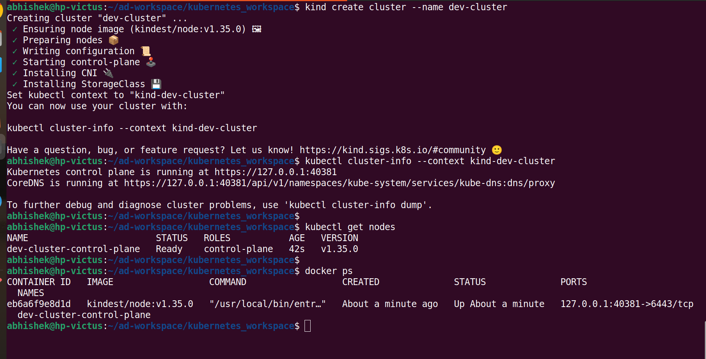
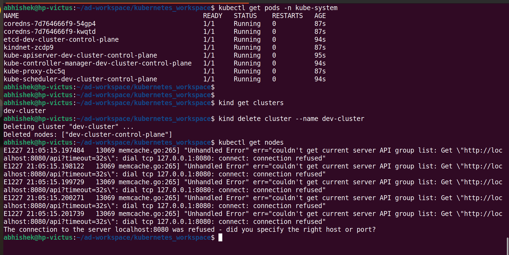

# Kubernetes Cluster

## Cluster Creation

* Use the below comand in **non-root user mode**

```
kind create cluster --name dev-cluster

```
* Verify Cluster Connection

```
kubectl get nodes
```
* Lists all running Docker containers

```
docker ps
```

<p align="left">

</p>


* Get pods list
```
kubectl get pods -n kube-system
```
* Get cluster list

```
kind get clusters

```
## Delete cluster

```
kind delete cluster --name dev-cluster
```

* Verify cluster is deleted
```
kubectl get nodes
```

<p align="left">

</p>

