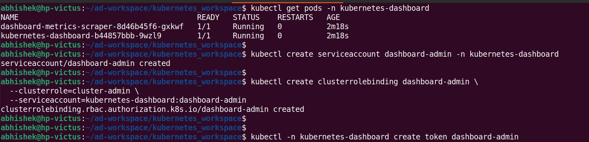
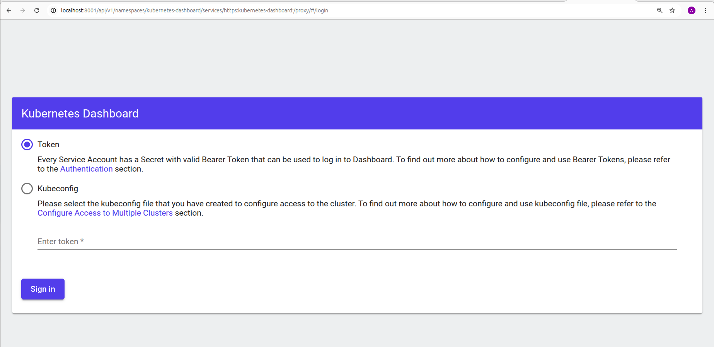
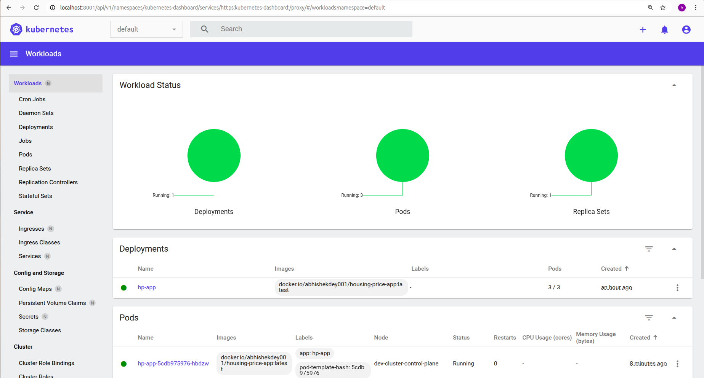

# Kubernetes Dashboard

* Install [non-root user mode]
```
kubectl apply -f https://raw.githubusercontent.com/kubernetes/dashboard/v2.7.0/aio/deploy/recommended.yaml
```
* check kubernetes-dashboard pod
```
kubectl get pods -n kubernetes-dashboard

```
* Create admin access
```
kubectl create serviceaccount dashboard-admin -n kubernetes-dashboard

```
```
kubectl create clusterrolebinding dashboard-admin \
  --clusterrole=cluster-admin \
  --serviceaccount=kubernetes-dashboard:dashboard-admin

```

* Get login token

```
kubectl -n kubernetes-dashboard create token dashboard-admin

```

<p align="left">

</p>

* Start Dashboard

```
kubectl proxy

```

* Paste the below url in browser

```
http://localhost:8001/api/v1/namespaces/kubernetes-dashboard/services/https:kubernetes-dashboard:/proxy/

```

<p align="left">

</p>

* Login using the token

<p align="left">

</p>
