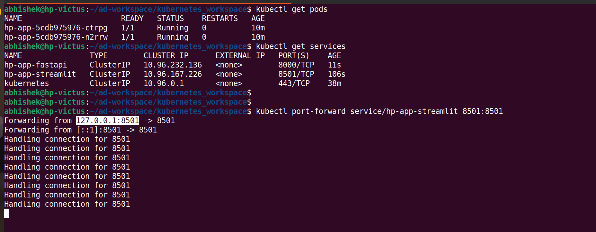
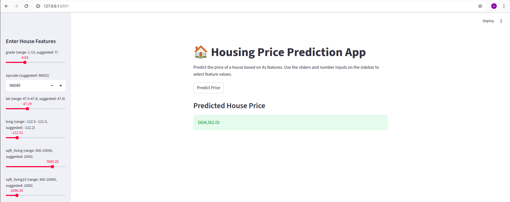
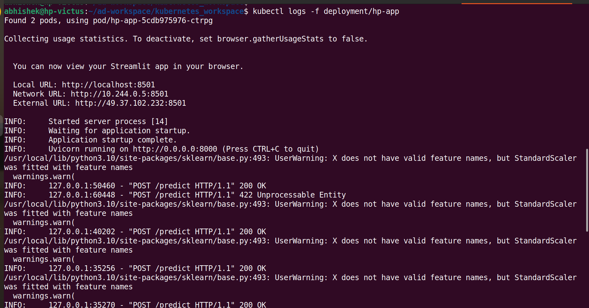

# Deployment

* Create deployment yaml file : [hp-app-deployment.yaml](hp-app-deployment.yaml) and apply

```
kubectl apply -f hp-app-deployment.yaml

```
* To see the pods
```
kubectl get pods
```

<p align="left">

</p>


* Expose streamlit (port 8501)
```
kubectl expose deployment hp-app \
  --name=hp-app-streamlit \
  --type=ClusterIP \
  --port=8501 \
  --target-port=8501

```
* Expose fastapi (port 8000)

```
kubectl expose deployment hp-app \
  --name=hp-app-fastapi \
  --type=ClusterIP \
  --port=8000 \
  --target-port=8000
```

* Now access the app

```
kubectl port-forward service/hp-app-streamlit 8501:8501

```

<p align="left">

</p>


* Check log live

```
kubectl logs -f deployment/hp-app
```

<p align="left">

</p>

## Kubernetes auto-recovery

* To see how kubernetes heals and recreates a replica, delete a pod

```
 kubectl delete pod hp-app-5cdb975976-n2rrw
```
* Check the healing process

```
kubectl get pods -w
```

<p align="left">

</p>

* The above image shows **Kubernetes self-healing in action**
* First of all one Pod is intentionally killed that belonged to a Deployment with replicas = 2.
* Kubernetes sends **SIGTERM**. Gives the container time to shut down gracefully
* Kubernetes notices:
```
replicas desired = 2
replicas running = 1

```
* So it creates a brand new Pod with a new name

* To scale replicas

```
kubectl scale deployment hp-app --replicas=3
```
